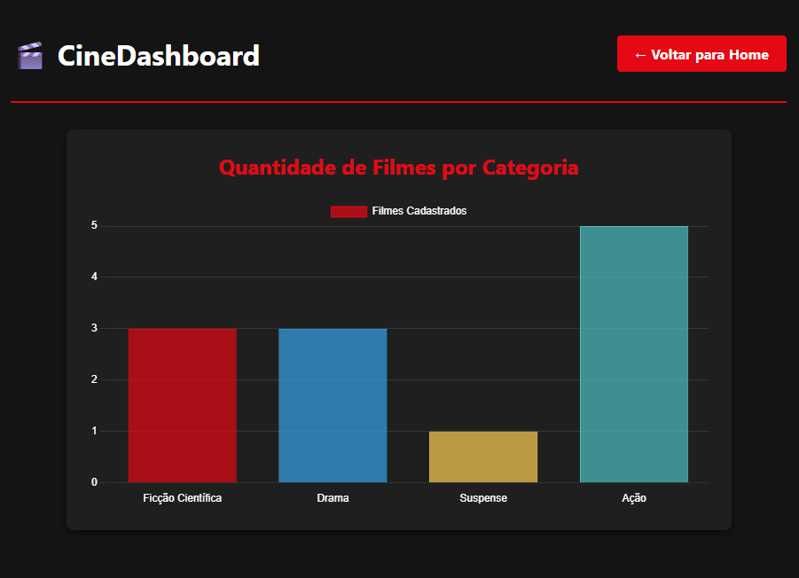
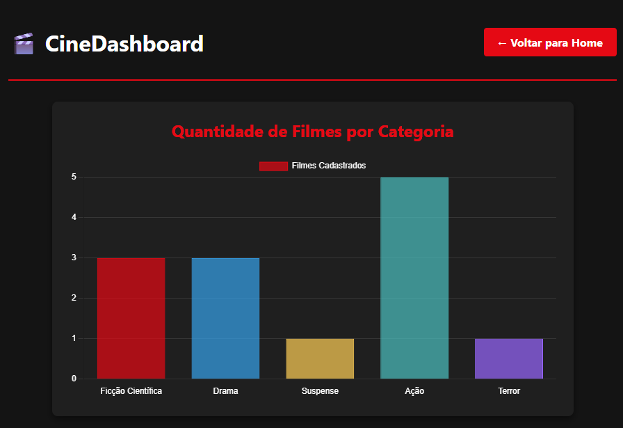

# Projeto CineDashboard - Apresentação Dinâmica de Dados

## 👤 Dados do Aluno
* **Nome:** Daniell
* **Curso:** Engenharia d Software / PUC MINAS

## 🎬 Sobre a Funcionalidade
Foi desenvolvida uma página de **Dashboard Dinâmico** integrada ao catálogo de filmes existente. A aplicação consome os dados do arquivo `db.json` via **JSON Server** e utiliza a biblioteca **Chart.js** para renderizar gráficos interativos e responsivos em tempo real.

* **Tipo de Visualização:** Gráfico de barras verticais.
* **Objetivo:** Exibir de forma clara e visual a quantidade de filmes cadastrados por cada categoria/gênero no sistema, auxiliando no gerenciamento do catálogo.

---

## 📊 Prints das Telas (Testes do CRUD)

### Teste 1: Estado Inicial do Catálogo
Gráfico exibindo as categorias iniciais cadastradas (Ficção Científica, Drama, Suspense e Ação).


### Teste 2: Atualização Dinâmica (Adição de Novo Gênero)
Gráfico atualizado em tempo real após a inserção de um filme na categoria **Terror** através do formulário de cadastro.


---

## 🗄️ Estrutura do Banco de Dados (JSON Server)

| Coleção | Descrição |
|---|---|
| `filmes` | Coleção principal com todos os filmes do catálogo |
| `categorias` | Lista de categorias disponíveis para os filmes |
| `avaliacoes` | Avaliações feitas por usuários para cada filme |
| `favoritos` | Lista de filmes marcados como favoritos |

### Exemplo de item (filmes)

```json
{
  "id": 1,
  "titulo": "Matrix",
  "descricaoCurta": "Um hacker descobre que a realidade é uma simulação.",
  "descricaoCompleta": "Thomas Anderson, um programador que vive uma dupla vida como hacker, descobre que o mundo em que vive é uma simulação chamada Matrix, controlada por máquinas.",
  "imagem": "[https://image.tmdb.org/t/p/w500/f89U3ADr1oiB1s9GkdPOEpXUk5H.jpg](https://image.tmdb.org/t/p/w500/f89U3ADr1oiB1s9GkdPOEpXUk5H.jpg)",
  "categoria": "Ficção Científica",
  "nota": 8.7,
  "ano": 1999,
  "diretor": "Lana e Lilly Wachowski",
  "duracao": "2h16min",
  "tags": ["ação", "ficção científica", "cyberpunk", "clássico"],
  "destaque": true
}
